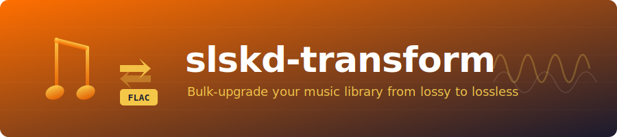

<p align="center">
  
</p>

<p align="center">
  <strong>Bulk-upgrade your music library from lossy to lossless via Soulseek</strong>
</p>

<p align="center">
  <a href="https://github.com/GeiserX/slskd-transform/blob/main/LICENSE"></a>
  <a href="https://www.python.org/"></a>
  <a href="https://github.com/slskd/slskd"></a>
  <a href="https://github.com/GeiserX/slskd-transform/stargazers"></a>
</p>

---

**slskd-transform** is a Python tool that scans your local music library, searches the [Soulseek](https://www.slsknet.org/) network through [slskd](https://github.com/slskd/slskd) for matching FLAC versions of each track, and automatically enqueues them for download. It matches songs by **audio duration** rather than filenames alone, ensuring you get the correct track every time. Songs that cannot be found are reported in a CSV file for manual follow-up.

A companion script handles post-download organization, renaming all downloaded FLACs into a clean `Artist - Title.flac` structure using embedded metadata.

## Features

- **Duration-based matching** -- Compares local track duration against search results with a configurable tolerance (default: 15 seconds), avoiding mismatches from inconsistent naming.
- **Multi-threaded search** -- Distributes searches across multiple threads (default: 5) for faster processing of large libraries.
- **Automatic enqueue** -- Matched FLAC files are enqueued for download directly through the slskd API.
- **CSV reporting** -- Tracks that could not be found are written to `unfound_songs.csv` for later review.
- **Metadata-based renaming** -- The `rename-files.py` script reads FLAC tags and renames files to `Artist - Title.flac`, sanitizing any invalid characters.

## Prerequisites

- **Python 3.8+**
- **[slskd](https://github.com/slskd/slskd)** running and accessible (by default at `http://127.0.0.1:5030`)
- A valid slskd **API key** (configured in slskd's settings)
- A local directory containing the lossy music files you want to upgrade

## Installation

```bash
git clone https://github.com/GeiserX/slskd-transform.git
cd slskd-transform
pip install -r requirements.txt
```

## Usage

### Step 1 -- Search and enqueue FLAC downloads

1. Place your lossy music files (MP3, AAC, OGG, etc.) in a `music/` directory inside the project root.
2. Open `main.py` and set your slskd connection details:

```python
slskd = slskd_api.SlskdClient(
    host="http://127.0.0.1:5030",
    api_key="YOUR_API_KEY",
    verify_ssl=False
)
```

3. Run the search:

```bash
python main.py
```

The script will search Soulseek for a FLAC version of each local track, match by duration, and enqueue any matches for download. Any songs that could not be found will be saved to `unfound_songs.csv`.

### Step 2 -- Rename downloaded FLACs

Once downloads are complete, use the renaming script to organize them:

1. Open `rename-files.py` and set the source and destination directories:

```python
source_directory = '/path/to/slskd/downloads'
destination_directory = '/path/to/organized/music'
```

2. Run the script:

```bash
python rename-files.py
```

All `.flac` files in the source directory (including subdirectories) will be renamed to `Artist - Title.flac` and moved to the destination.

## Configuration

| Parameter | Location | Default | Description |
|---|---|---|---|
| `host` | `main.py` | `http://127.0.0.1:5030` | slskd instance URL |
| `api_key` | `main.py` | -- | Your slskd API key |
| `MUSIC_DIR` | `main.py` | `./music` | Directory containing lossy source files |
| `duration_tolerance` | `main.py` | `15` (seconds) | Maximum duration difference for a match |
| `num_threads` | `main.py` | `5` | Number of concurrent search threads |
| `source_directory` | `rename-files.py` | -- | Where slskd downloads land |
| `destination_directory` | `rename-files.py` | -- | Where renamed FLACs are moved |

## How It Works

```
Local library          Soulseek network          Your disk
 (lossy files)                                   (FLAC files)

  song.mp3  ──────>  Search "song flac"  ──────>  song.flac
       │                     │                        │
  read duration        compare duration          enqueue if
  with mutagen         (+/- 15 seconds)          match found
       │                     │                        │
       └──── no match ──>  unfound_songs.csv          │
                                                      v
                                            rename-files.py
                                          Artist - Title.flac
```

1. **Scan** -- `main.py` reads every file in the `music/` directory using [mutagen](https://mutagen.readthedocs.io/) to extract the audio duration.
2. **Search** -- For each track, a Soulseek search is issued via the slskd API with the query `"<song name> flac"`. Searches run in parallel across multiple threads with staggered starts to avoid flooding the network.
3. **Match** -- Each search result is compared by duration. The first result within the tolerance window is selected.
4. **Enqueue** -- Matched files are enqueued for download through slskd. Failed or unmatched tracks are logged.
5. **Rename** -- After downloading, `rename-files.py` walks the download directory, reads FLAC metadata, and moves files into a flat structure with clean filenames.

## License

This project is licensed under the [MIT License](LICENSE).
