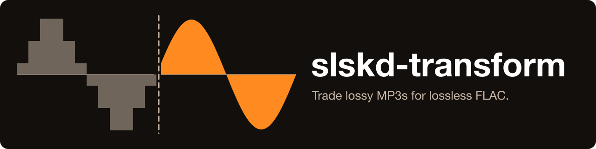

---
hide:
  - navigation
---

# slskd-transform { .st-visually-hidden }

<p align="center">
  
</p>

<p align="center">
  <a href="https://github.com/GeiserX/slskd-transform/stargazers"></a>
  <a href="https://github.com/GeiserX/slskd-transform/releases"></a>
  <a href="https://github.com/GeiserX/slskd-transform/actions/workflows/tests.yml"></a>
  <a href="https://github.com/GeiserX/slskd-transform/blob/main/LICENSE"></a>
</p>

---

**slskd-transform** is a command-line tool that reads every track in your music library, searches the [Soulseek](https://www.slsknet.org/) network through your [slskd](https://github.com/slskd/slskd) for a FLAC copy of it, and queues the match in slskd for download. It searches by the file name, then accepts only a copy whose length is within 15 seconds of your track, so a live cut or an extended mix of the same title is not queued. Doing the same by hand in the slskd web UI is one search, one comparison and one click per track; the tracks it cannot match are listed in a CSV file for you to look at. Start with [Getting started](getting-started.md), then [Usage](usage.md).

<div class="grid cards" markdown>

-   :material-download: **[Getting started](getting-started.md)**

    ---

    Install it with pip, give it your slskd address and API key, and point it at your library.

-   :material-console: **[Usage](usage.md)**

    ---

    The two commands, `search` and `rename`, with examples and every flag.

-   :material-tune: **[Configuration](configuration.md)**

    ---

    The config file, the `SLSKD_` environment variables, their defaults, and which source wins.

-   :material-lifebuoy: **[Troubleshooting](troubleshooting.md)**

    ---

    The errors people have hit, what causes each, and what to put in an issue.

</div>

## What a run looks like

A library with three tracks. Two have a FLAC copy on Soulseek within 15 seconds of their length and are queued in slskd; the third only turns up in a live cut almost a minute longer, so it is written to `unfound_songs.csv`. When slskd has finished the downloads, `rename` files them by their tags.

```console
$ slskd-transform --threads 1 search --music-dir library --recursive
Searching for: Demo Band Night Train
Failed to find matching song with close duration for: Demo Band - Night Train
Searching for: Demo Band Slow Tide
Enqueueing: @@demo\Demo Band\Slow Tide.flac
Enqueued: @@demo\Demo Band\Slow Tide.flac
Searching for: Demo Band Harbour Lights
Enqueueing: @@demo\Demo Band\2019 - Coastline [FLAC]\03 Harbour Lights.flac
Enqueued: @@demo\Demo Band\2019 - Coastline [FLAC]\03 Harbour Lights.flac
Unfound songs have been written to 'unfound_songs.csv'

$ slskd-transform rename --source-dir downloads --dest-dir organized
Moved and renamed: organized/Demo Band - Slow Tide.flac
Moved and renamed: organized/Demo Band - Harbour Lights.flac
```

## How it runs

- One Python package, installed from GitHub with pip, Python 3.10 or newer. It needs a running [slskd](https://github.com/slskd/slskd) and an API key from slskd's settings. It never talks to Soulseek itself.
- `search` reads the length of every audio file in the folder, sends slskd the file name plus `flac`, waits `search_timeout` seconds (60 by default), then takes the first file of each peer's answer in slskd's order and queues the first one whose length is close enough. Five searches run side by side by default, so a library of 1,000 tracks takes more than three hours. See [How it works](how-it-works.md).
- Settings come from `config.yml`, `SLSKD_` environment variables or flags, in that order of strength. See [Configuration](configuration.md).

## What it does not do

- It does not download anything itself: it queues the file in slskd, and slskd downloads it into its own downloads folder.
- It does not check that a downloaded FLAC is truly lossless; a lossy file re-saved as FLAC passes.
- It does not skip tracks that are already FLAC: every audio file in the folder is searched.
- It does not change your library. `search` only reads it (and writes `unfound_songs.csv` into it); `rename` moves files from the downloads folder into the folder you name.
- It has no published Docker image yet.

## Privacy

- Your files never leave your disk. What goes out are search texts made from your file names, sent to your own slskd, which searches Soulseek with them as your Soulseek user.
- The tool keeps no history and sends nothing anywhere else. Apart from the files `rename` moves, the only file it writes is `unfound_songs.csv`.

## Getting help

- Something broken: read [Troubleshooting](troubleshooting.md), then open an [issue](https://github.com/GeiserX/slskd-transform/issues) with the details it lists.
- A security problem: follow the [security policy](https://github.com/GeiserX/slskd-transform/blob/main/SECURITY.md), never a public issue.
- Running it from a checkout, the tests, releases: [Development](development.md).

## Related projects

- [telegram-slskd-local-bot](https://github.com/GeiserX/telegram-slskd-local-bot): one song at a time from a Telegram chat, through the same slskd.
- [audio-transcode-watcher](https://github.com/GeiserX/audio-transcode-watcher): watches a folder and transcodes new music into other formats, with lyrics.

## License

slskd-transform is released under the [GPL-3.0-or-later](https://github.com/GeiserX/slskd-transform/blob/main/LICENSE) license.
